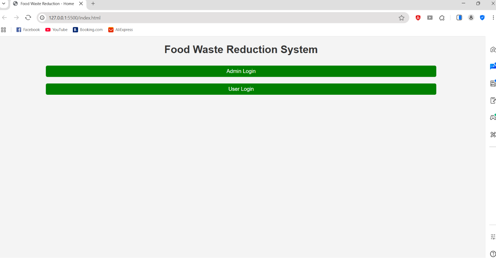

# 🍱 Food Waste Reduction System

A responsive web application developed using **HTML, CSS, and JavaScript** to reduce food wastage by connecting food donors with people in need. The application provides separate interfaces for administrators and users, enabling efficient food donation management.

---

## 📌 Project Overview

The Food Waste Reduction System allows users to donate surplus food through a simple and user-friendly interface. Administrators can monitor donation activities, while users can access their dashboards to manage food donations. The project aims to reduce food waste and support community food sharing.

---

## 🚀 Features

### 👤 User Module

- 🔐 User Login
- 🍱 Donate Food
- 📋 User Dashboard
- 📱 Responsive Interface

### 👨‍💼 Admin Module

- 🔐 Admin Login
- 📊 Admin Dashboard
- 📋 Monitor Food Donations
- 📈 View Donation Details

---

## 🛠 Tech Stack

| Category | Technologies |
|----------|--------------|
| Frontend | HTML5, CSS3, JavaScript |
| Storage | Local Storage |
| IDE | Visual Studio Code |
| Version Control | Git & GitHub |

---

## 📁 Project Structure

```text
Food-Waste-Reduction-System/
│
├── images/
│   ├── home.png
│   ├── admin login.png
│   ├── admin dashboard.png
│   ├── user login.png
│   ├── user dashboard.png
│   └── donate food page.png
│
├── admin-login.html
├── admin.html
├── dashboard.html
├── donate-food.html
├── index.html
├── next_login.html
├── user-dashboard.html
├── user-login.html
├── script.js
├── style.css
└── README.md
```

---

## ⚙️ Setup Instructions

### 1️⃣ Clone the Repository

```bash
git clone https://github.com/tejaswikedarisetti/Food-Waste-Reduction-System.git
```

### 2️⃣ Open the Project

Open the project folder in **Visual Studio Code**.

### 3️⃣ Run the Application

Install the **Live Server** extension in VS Code.

Right-click on **index.html** and select **Open with Live Server**.

---

## 💡 Project Workflow

1. Open the Home Page.
2. Select **Admin Login** or **User Login**.
3. Users can donate surplus food.
4. Donation details are stored using Local Storage.
5. Administrators monitor donation information through the dashboard.

---

## 📸 Application Screenshots

### 🏠 Home Page



---

### 🔐 Admin Login


---

### 📊 Admin Dashboard


---

### 👤 User Login


---

### 👤 User Dashboard


---

### 🍱 Donate Food Page


---

## 🌟 Key Highlights

- Responsive Web Design
- Separate Admin & User Login
- Food Donation Management
- Admin Dashboard
- User Dashboard
- Local Storage Support
- Easy Navigation
- Beginner-Friendly Project

---

## 📈 Future Enhancements

- User Registration
- Database Integration (MySQL)
- Email Notifications
- Google Maps Integration
- NGO Collaboration
- Search & Filter Functionality
- Mobile Application
- Food Expiry Alerts

---

## 🎯 Learning Outcomes

- HTML5
- CSS3
- JavaScript
- DOM Manipulation
- Local Storage
- Responsive Web Design
- Event Handling
- Git & GitHub

---

## 👨‍💻 Author

**Sai Tejaswi**


GitHub: https://github.com/tejaswikedarisetti

